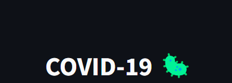

# COVID-19 Dashboard (Trabalho Acadêmico)



Este é um repositório que contém uma aplicação de dashboard criada com Python e Streamlit para acompanhar e visualizar os casos de COVID-19 em todo o mundo. A aplicação permite que os usuários analisem tendências de casos confirmados e mortes, bem como configure filtros para uma análise mais detalhada. Este projeto foi desenvolvido como parte de um trabalho acadêmico, com o objetivo de fornecer uma interface amigável e informativa para ajudar as pessoas a acompanhar a propagação da pandemia.

**Nota:** A base de dados utilizada neste projeto pode sofrer alterações, portanto, a formatação dos dados pode precisar ser ajustada periodicamente para garantir sua correta visualização.

## Recursos

- Visualização de casos de COVID-19 em todo o mundo.
- Gráficos interativos para análise de tendências.
- Possibilidade de filtrar os dados por país.
- Dados atualizados regularmente a partir de fontes confiáveis.

## Pré-requisitos

- Python 3.x instalado em sua máquina.
- Bibliotecas Python: pandas, streamlit, altair. Você pode instalá-las usando o arquivo `requirements.txt`.

## Instalação

1. Clone o repositório:

```bash
git clone https://github.com/seu-usuario/covid19-dashboard.git
```

2. Navegue para o diretório do projeto:

```bash
cd covid19-dashboard
```

3. Instale as dependências:

```bash
pip install -r requirements.txt
```

## Uso

1. Execute o aplicativo Streamlit:

```bash
streamlit Streamlit_Covid.py
```

2. Acesse o dashboard em seu navegador em [http://localhost:8501](http://localhost:8501).

3. Na interface do dashboard, você pode selecionar as opções para filtrar os dados, escolher o tipo de gráfico (cumulativo ou diário), definir um número mínimo de casos confirmados ou mortes, e muito mais. Explore as diferentes funcionalidades para obter insights sobre a situação do COVID-19 em todo o mundo.

## Contribuição

Este projeto foi desenvolvido como parte de um trabalho acadêmico, mas estamos abertos a contribuições da comunidade. Se você deseja contribuir, siga estas etapas:

1. Crie um fork do repositório.
2. Faça suas modificações e adições.
3. Envie um pull request com uma descrição detalhada das alterações.

## Agradecimentos

Agradecemos a todos os desenvolvedores e organizações que disponibilizam os dados relacionados ao COVID-19, tornando possível este projeto.

